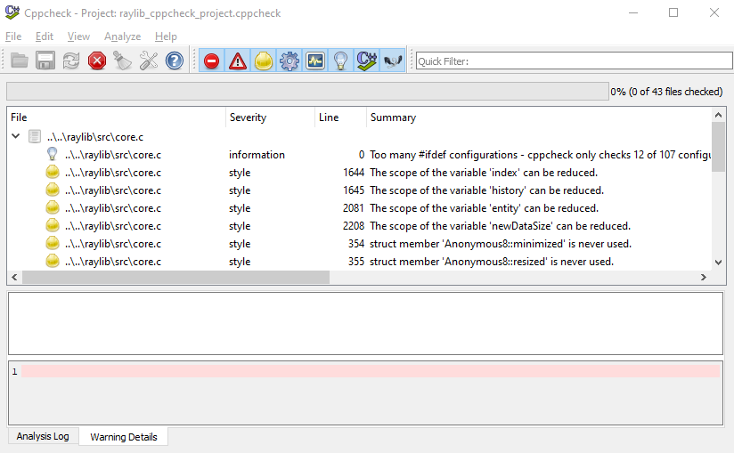
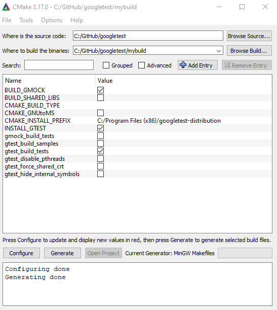
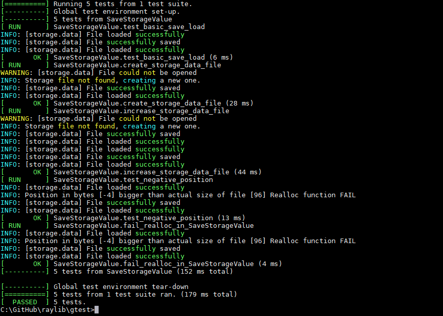

## ABOUT THIS REPOSITORY

This repository is an annex repository for raylib library:

https://github.com/raysan5/raylib

In this repository two main contents can be found:

* **cppcheck** project and test resulst of raylib/src code. This tool performs a static analysis of the code and generates a report.
* **Unit test** done with Google Test for raylib functions. This folder contains a set of black box test of the `raylib` functions.

The best proposal for running this tools is to organize the repositories in the next way:

* `C:\MinGW`              -> MingGW tool
* `C:\GitHub\raylib`      -> Raylib repository
* `C:\GitHub\raylib_test` -> Raylib test repository
* `C:\GitHub\googletest`  -> Google test repository

## CPPCHECK

This tool can be downloaded from http://cppcheck.sourceforge.net/

The folder `raylib_test\cppcheck` contains the project for this tool, configured to analyze `../../raylib/src` folder.

## Unit test for raylib using Google Test

We are going to use the Open source Tool Google Test for generating and launching  Unit Tests. Please consider reading some information before start:

* https://en.wikipedia.org/wiki/Unit_testing
* https://github.com/google/googletest
* https://github.com/google/googletest/blob/master/googletest/docs/primer.md

## Steps for preparing the Google Test environment for Raylib

1) Intall **MinGW** if it's not already installed.

2) Install **Cmake** from: https://cmake.org/download/

3)  Clone **Google Test** repository  https://github.com/google/googletest

The expected download directory  for google test is:

	`C:\GitHub\googletest`
If a different one is choosen, please update the path in the bat file.

4) Create a directory for the build:

	`C:\GitHub\googletest\mybuild`

5) Configure and generate with CMake, as describe in image

	

6)  Compile google test, using **make**:
	`C:\GitHub\googletest\mybuild>mingw32-make`

## Compile and run unit test ##

This repository contains a folder called `raylib_test\gtest` with the implemented Unit Test, and a batch file for its compilation and execution. 

**IMPORTANT**:
* This tests are black box tests: the library is already compiled, and only the public interfaces defined in `raylib.h` are abailable for test.

* The batch file contains the absolute paths to the Google test static library compiled in the previous steps. If the paths are different, please update them.

* As we are going to test **raylib** and its included in the compilation via `-lraylib` sure that MINGGW contains your last compilation of raylib, so you are testing the latest changes in raylib. Copy libraylib.a from `raylib\src` to `C:\MinGW\i686-w64-mingw32\lib` and `raylib.h` to  `C:\MinGW\i686-w64-mingw32\include`.

* The compilation of the Unit Test has not the option `-mwindows` so al the **TRACELOG** from raylib will be seen on the console.

For compiling and test execution run the bach file for one unit test file:

`C:\GitHub\raylib_test\gtest>raylib_compile_gtest.bat core_ut.cpp`

The result shall looks something like this:

